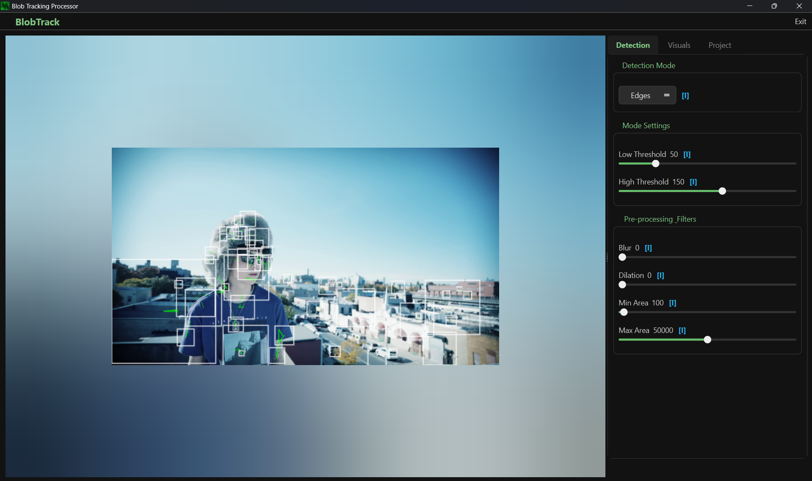

# User Guide

This guide will walk you through the entire workflow of creating visuals with BlobTrack.

## 1. The Interface

The BlobTrack interface is divided into two main areas: the **Preview Window** on the left and the **Control Panel** on the right.

## 2. Loading a Video

To start, you need a source video file. Ideally, choose footage with good contrast between the subject and background for the best tracking results.

1.  Click the **Select Video File** button at the top of the Control Panel.
2.  Navigate to your video file (MP4, AVI, MOV, etc.) and open it.
3.  The video will begin playing in loop mode automatically.
---

## 3. Detection Settings

The **Detection** tab controls *what* part of the video is turned into blobs.

### Detection Modes
Select one of the following modes from the dropdown:

*   **Threshold**: Uses brightness differences. Good for silhouettes.
*   **Canny (Edges)**: Detects outlines and edges. Creates wireframe-like effects.
*   **Color**: Isolates a specific color range.

### Refining the Detection
*   **Blur**: Smooths out video noise before detection. Increase this if your blobs are too jittery.
*   **Min Area**: Removes small specks or noise.
*   **Max Area**: Ignores blobs that are too large (e.g., the entire screen).
*   **Threshold / Canny Controls**: Adjust these sliders to fine-tune the sensitivity of the detection.

---

## 4. Visual Styles

The **Visuals** tab controls *how* the detected blobs look.

### Shape & Outline
*   **Fill Shapes**: Toggles whether blobs are solid or just outlines.
*   **Smooth Mesh**: Applies smoothing to the blob contours for a more organic look.
*   **Outline Width**: Controls the thickness of the blob borders.

### Color Effects
*   **Solid Color**: Uses a single static color (pickable via the color wheel).
*   **Rainbow Cycle**: Automatically cycles through colors over time.
*   **Breath**: Pulse a single color's brightness up and down.
*   **Speed**: Controls how fast the Rainbow or Breath effects animate.

---

## 5. Exporting Your Work

Once you are happy with your visual:

1.  Click the **Export Processed Video** button.
2.  Choose a destination for your file.
3.  The app will process the video frame-by-frame.
    *   *Note: This might be slower than real-time playback depending on your settings.*
4.  Once finished, you will have a high-quality video file of your creation!

